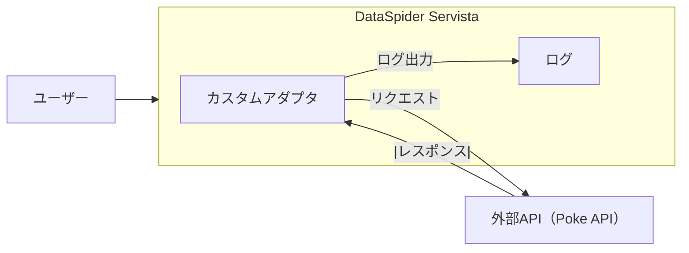
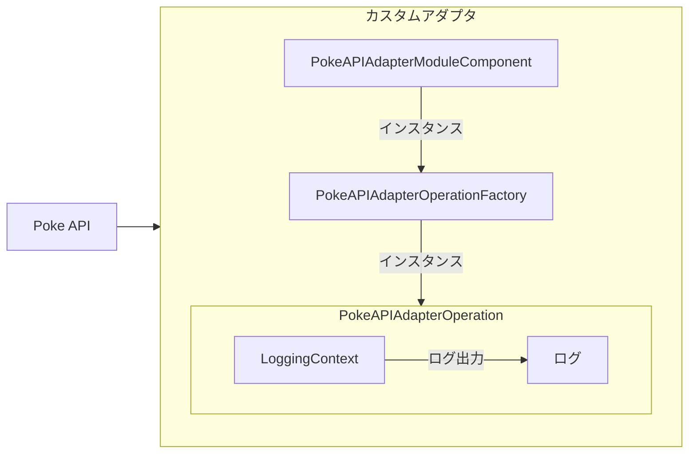

# アーキテクチャ設計

## システム構成図

## コンポーネント
各主要コンポーネント（モジュール、クラス、デザイナスクリプトなど）を説明し、どのように相互に通信するのかを説明します。
| アダプタ名   | Poke API Adapter                                                                               |
| ------------ | ---------------------------------------------------------------------------------------------- |
| モジュール名 | poke_api_adapter                                                                               |
| パッケージ名 | com.appresso.ds.dp.modules.adapter.pokeapi                                                     |
| クラス構成   | PokeAPIAdapterOperation   PokeAPIAdapterOperationFactory   PokeAPIAdapterModuleComponent |

## データフロー
データがどのように流れるのかを詳細に記述します。どのコンポーネントがデータを生成、変換、消費するのかを説明します。  

### データフローの概要

1. **入力**:
   - なし 

2. **データソース**: Poke API
   - APIエンドポイントにリクエストを送信し、データを取得（形式: JSON）。

3. **データ受け渡し**:
   - レスポンスを受け取った段階で、そのステータスコード（例: 200 OK）やエラーメッセージを確認。
   - 正常にデータが取得できたかどうかを判定し、エラーがあれば、それに応じたエラーハンドリングを行う。

4. **変換と処理**:
   - テキストに変換。

5. **データ出力**:
   - `OperationContext`の`log()`から取得できる`LoggingContext`で出力（形式: テキスト）。
   -  APIリクエスト開始・終了、レスポンスのステータスコード、主要な取得項目をinfoレベルで出力。エラー時はerrorレベルで詳細を出力。

6. **エラーハンドリング**:
   - アダプタ内での処理状況やエラーは、DataSpider標準のログに出力。

### データフロー図

## 接続詳細
OperationFactoryで定義すべきプロパティである、API接続の詳細（エンドポイント、認証方法、通信プロトコルなど）について説明します。  

接続対象:
- Poke API
- エンドポイントURL: `https://pokeapi.co/api/v2/pokemon/{id}`
   
接続プロトコル:
- HTTPSを使用し、安全で暗号化された通信を行う。

HTTPメソッド:
- 主にGETメソッドを使用してデータを取得。

ヘッダー情報:
- Content-Type: application/json （取得するデータがJSONのため）
- Accept: application/json

タイムアウト設定:
- 接続タイムアウトはxxx秒に設定。

再試行ポリシー:
- 接続が失敗した場合、最大3回までの再試行を実施。
- 再試行は5秒の間隔をおく。

エラー処理:
- リクエストが失敗した場合はエラーログに記録。
- ステータスコードにより異常を判断し、適切に対応。

## 技術スタック
使用する技術やツール（言語、フレームワーク、ライブラリ、外部サービス）について説明します。

Java（プログラミング言語）:
- Azul Zulu Builds of OpenJDK 8u382b05 (8.72.0.17)

DataSpider Servista:
-  4.5（データ統合ツール）

<!-- ライブラリ -->

開発環境:
- Visual Studio Code（Java開発）

ant（ビルドツール）:
- 1.10.14

バージョン管理システム:
- Git（バージョン管理）
   - GitHub（ソースコードのホスティング）

<!-- プロジェクト管理ツール -->

<!-- その他のツール -->

## セキュリティ設計
データの保護と通信のセキュリティに関する情報について説明します。

認証と認可:
- Poke APIは認証を必要としないため、アクセスコントロールは実装しない。
   
データ保護:
- 通信中のデータを保護するためにHTTPSを使用。（SSL/TLSの設定）
- 機密データは扱わないため、静的データの暗号化は不要。

通信のセキュリティ:
- HTTPSを介した暗号化通信を推奨。

<!-- セキュリティポリシー -->

エラーハンドリングとログ:
- すべての接続エラーをログに記録。
- 想定外のレスポンスや軽微な異常はwarnレベルで出力する。

<!-- 依存ライブラリの管理
- 使用するライブラリは定期的に更新。
- パッチ適用と定期的な脆弱性スキャン。 -->

<!-- ## 非機能要件
パフォーマンス要件、スケーラビリティ、可用性などの非機能的側面について説明します。 -->

## スケーラビリティと拡張性
将来的な拡張可能性に関して考慮した設計思想について説明します。  

- 今後、「入力データの定義」や「出力フォーマットの指定」など、機能追加を段階的に行う予定。
- ベースとなるデータ取得部分をシンプルに設計し、プロパティや入出力仕様の追加・変更が容易な構造にしている。
- 将来的にはAPI認証対応、プロキシ設定、グローバルリソース化、複数Operation対応なども柔軟に追加できる設計方針。

## 設計の検討事項
設計における重要な選択肢や考慮した点、そしてその背景について説明します。

- 初学者がDataSpider SDKの基本構造（AdapterModuleComponent/OperationFactory/Operation）を理解しやすいよう、最小限のクラス構成としました。
- グローバルリソースは不要です。
- ログ出力方針やエラーハンドリングも明示し、運用・デバッグ時のトラブルシュートを容易にしました。
